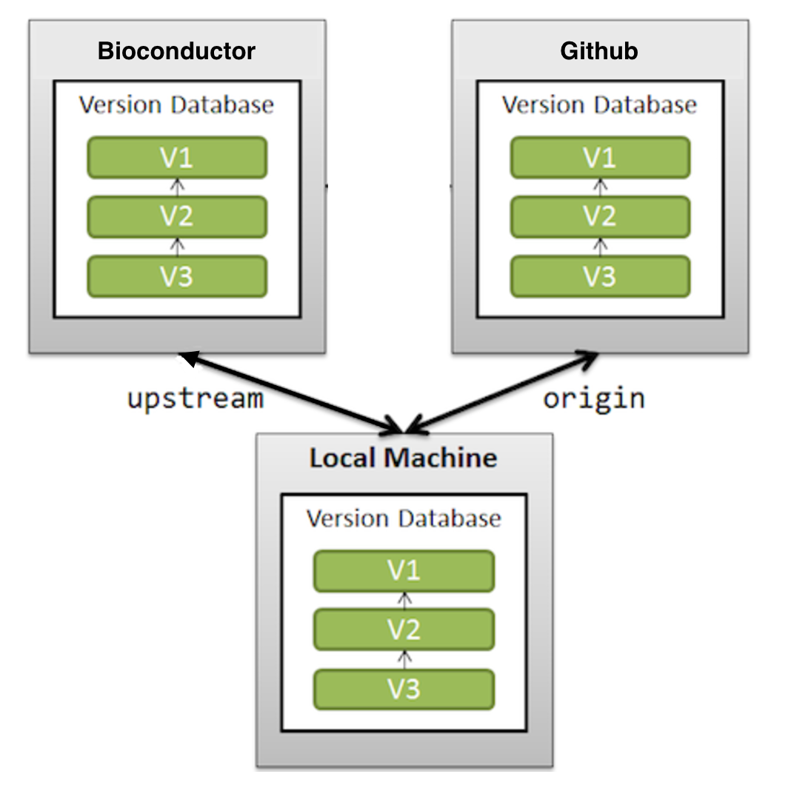

# Overview of how the Bioconductor git server works


**Goal:** You are a _developer_ of a Bioconductor package and are curious about how the Bioconductor git server and GitHub work in tandem. This document gives you a brief synopsis of how they work.

This image will be used to describe how this process works.



## Image Description

There are three boxes in this image, each represent one `git` database. The database in all three of these locations is for a single Bioconductor package (example: BiocGenerics).

The three locations of these git databases are.

1. **Biconductor** Server : The git database for the package being hosted on the Bioconductor server.

2. **GitHub** Server : The git database for the package being hosted on the GitHub server but for the user/developers account.

3. **Local machine** : The user/developers local machine. Only this is available to the user/developer to interact with the Bioconductor server or GitHub server.

The arrows in the image represent direction of the `fetch` and `push` process which can be issued by your local machine through git.

## Some git lingo

A `remote` refers to a location for the database, and the user/developer interacts with the `remote` from his local mahcine. So in our case since we have two remote locations, the user would have two remotes set up. We call it by convention, but they can be called anything eg. "foo", "bar".

1. `origin`: This is the GitHub remote location, and we call it `origin`.

2. `upstream`: This is the Bioconductor remote location, and we call it `upstream`.

NOTE: Local machine is not a remote, since you issue git commands on the local machine.

## Remote setup

A developer has a git database for the package on their local machine. This "repository" is supposed to have `remote` locations set up so that they can interact with both Bioconductor and GitHub.

Check for remotes

```
git remote -v
```

If its empty, then add ther remotes,

```
git remote add origin git@github.com:<GitHub username>/<BiocGenerics>.git
git remote add upstream git@git.bioconductor.org:packages/<BiocGenerics>.git
```

Now if you try, `git remote -v`, this should show up:

```
origin  git@github.com:<GitHub username>/BiocGenerics.git (fetch)
origin  git@github.com:<GitHub username>/BiocGenerics.git (push)
upstream    git@git.bioconductor.org:packages/BiocGenerics.git (fetch)
upstream    git@git.bioconductor.org:packages/BiocGenerics.git (push)
```

The reason, you have `fetch` and `push` for each remote is because you want to be able to sync your local machine's repository to both locations. By sync, it means getting commits from the remote locations using the `fetch` process, and then `push` commits from your local machine to the remote locations.

You can only `fetch` and `push` through your local machine to either GitHub or Bioconductor. You cannot `fetch` or `push` from Github to Bioconductor directly. You local machine acts as the intermediate git repository to sync your package between GitHub and Bioconductor.

## Developers/Maintainers vs Users

For **users** of Bioconductor and these GitHub repositories, they will work with `HTTPS`, and will only have `fetch` permissions to the Bioconductor repository. They can have both `fetch` and `push` permissions to GitHub depending on how the owner sets up his GitHub repository.

For users, the remotes will look like

```
origin  https://github.com/<GitHub username>/BiocGenerics.git (fetch)
origin  https://github.com/GitHub username>/BiocGenerics.git (push) ## MAY or MAY NOT WORK
upstream    https://git.bioconductor.org:packages/BiocGenerics.git (fetch)
upstream    https://git.bioconductor.org:packages/BiocGenerics.git (push) ## WILL NOT WORK
```
